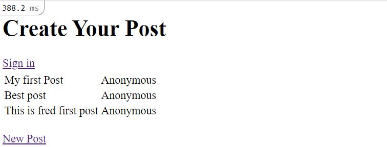
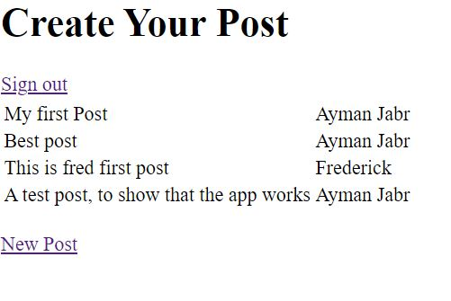

# Members-only Project
 This project consist of building a twitter-like page, where users can 
 sign_in and make a post.

## Instructions
1. Download a clone locally git clone https://https://github.com/AymanJabr/Members-Only-Rails
2. Enter the project folder cd members-only
3. Enter the proper branch `git checkout feature/members-only`, or `git checkout development`
4. Add the necessary gems required in the Gemfile
5. Install the necessary gems by using the command 'bundle install'
6. Migrate the database using the command 'rake db:migrate'
7. If sign_in, you can create a post
## Authors :bust_in_silhouette:
### Frederick Mih
\_[Github](https://github.com/FrederickMih)
\_[LinkedIn](https://www.linkedin.com/in/frederick-mih/)
### Ayman Jabr
\_[Github](https://github.com/AymanJabr/)
\_[LinkedIn](https://www.linkedin.com/in/ayman-jabr-3705a4100/)
## Show your support :star:️:star:️:star:️
Give a star if you like this project!
## License :memo:
This project is [MIT](https://www.mit.edu/~amini/LICENSE.md) licensed.